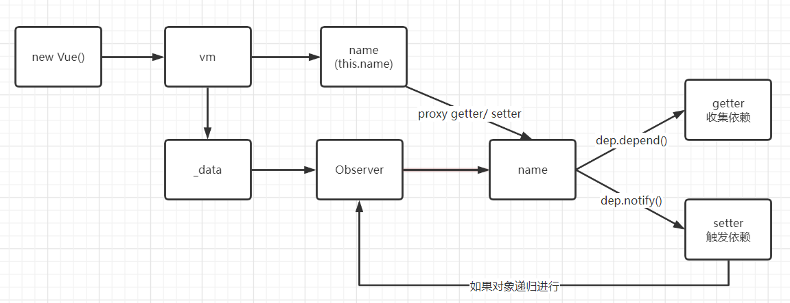

# Observer

数据响应分为`Observer`和`Watcher` 两个核心部分组成

根据之前的分析可知，`Vue` 是在`_init` 方法中的`initState(vm)` 完成对数据观测

```js
// data, props, computed 在这里初始化, Vue是如何实现数据响应化
initState(vm)
```

接着找到这个方法

```JS
// src/core/instance/state.js
export function initState (vm: Component) {
  vm._watchers = []
  const opts = vm.$options
  if (opts.props) initProps(vm, opts.props) // 处理 props 代理到_props上，并进行响应式观测
  if (opts.methods) initMethods(vm, opts.methods) // 把methods上的方法绑定到vm上
  if (opts.data) {
    initData(vm) // 处理data => vm[key] proxy => vm._data
  } else {
    observe(vm._data = {}, true /* asRootData */)
  }
  if (opts.computed) initComputed(vm, opts.computed) // 处理计算属性
  if (opts.watch && opts.watch !== nativeWatch) {
    initWatch(vm, opts.watch)
  }
}
```

 先忽略上面，先看 `initData(vm)`

```JS
function initData (vm: Component) {
  let data = vm.$options.data
  // 1. 通过 getData 方法 执行 data()
  data = vm._data = typeof data === 'function'
    ? getData(data, vm)
    : data || {}
  if (!isPlainObject(data)) {
    // 如果返回值不是一个对象则提醒需要返回对象，并自己创建一个对象接着下一步
    data = {}
  }

  const keys = Object.keys(data)
  let i = keys.length
  while (i--) {
    const key = keys[i]
    // 4. 如果data在 props, methods中存在相同键值发起警告，省略
    if (!isReserved(key)) {
      // 代理
      // 5. this.meg => this._data.msg
      proxy(vm, `_data`, key)
    }
  }
  // 6. 观测数据
  observe(data, true /* asRootData */)
}

export function getData (data: Function, vm: Component): any {
  // 2. 调用数据获取器时通过push一个null值 禁用 Dep 收集 
  pushTarget()
  try {
    return data.call(vm, vm)
  } catch (e) {
    handleError(e, vm, `data()`)
    return {}
  } finally {
    // 3. 完成数据获取后 pop 出 null
    popTarget()
  }
}

```

除开最后一行，实际上是做了一些数据初始化、清空Dep对象和_data数据代理的的工作，接着往下看 `  observe(data, true /* asRootData */)`

```JS

/**
 *尝试为一个值创建一个观察者实例，
 *如果成功观察，则返回新的观察者，
 *或现有的观察者，如果该值已经有一个
 */
export function observe (value: any, asRootData: ?boolean): Observer | void {
  // 省略类型判断、监听判断后，这个方法实际上是new了一个Observer实例
  ob = new Observer(value)
  return ob
}
```

接着找到 `Observer` 类

```JS

/**
  *附加到每个观察到的观察者类
  *目的。连接后，观察者转换目标
  *对象的属性键到 getter/setter 中
  *收集依赖并调度更新。
*/
export class Observer {
  value: any;
  dep: Dep;
  vmCount: number; // number of vms that have this object as root $data

  constructor (value: any) {
    // 初始化 this.value
    this.value = value
    // new 一个 Dep 对象用来记录依赖
    this.dep = new Dep()
    // 
    this.vmCount = 0
    // 往 value.__ob__ 上指向当前的对象，避免重复监听
    def(value, '__ob__', this)
    if (Array.isArray(value)) {
      // 如果是数组，走数组观测方法，劫持数组改变方法
      if (hasProto) {
        protoAugment(value, arrayMethods)
      } else {
        copyAugment(value, arrayMethods, arrayKeys)
      }
      // 如果数组，每一项都进行递归 observe
      this.observeArray(value)
    } else {
      this.walk(value)
    }
  }

  /**
   * 遍历所有属性并将它们转换为获取器/设置器。
   * 此方法仅应在以下情况下调用：值类型是对象。
   */
  walk (obj: Object) {
    const keys = Object.keys(obj)
    for (let i = 0; i < keys.length; i++) {
      // 对每一个 key 进行 defineReactive
      defineReactive(obj, keys[i])
    }
  }

  /**
   * 观测数组每一项，递归调用
   */
  observeArray (items: Array<any>) {
    for (let i = 0, l = items.length; i < l; i++) {
      observe(items[i])
    }
  }
}
```

由上面可知，如果对象类型，直接对所有的`key`执行`defineReactive`方法，数组则通过劫持数组原型上的方法进行观测

```JS
// /src/core/observer/array.js
import { def } from '../util/index'
// 复制一份原型对象
const arrayProto = Array.prototype
export const arrayMethods = Object.create(arrayProto)
// 被监听方法数组
const methodsToPatch = [
  'push',
  'pop',
  'shift',
  'unshift',
  'splice',
  'sort',
  'reverse'
]

/**
 * 拦截变异方法并发出事件
 */
methodsToPatch.forEach(function (method) {
  // 缓存原方法
  const original = arrayProto[method]
  def(arrayMethods, method, function mutator (...args) {
    // 原型上重新定义方法
    const result = original.apply(this, args)
    // 取到实例
    const ob = this.__ob__
    let inserted
    switch (method) {
      case 'push':
      case 'unshift':
        inserted = args
        break
      case 'splice':
        inserted = args.slice(2)
        break
    }
    // 如果新增项，接着监听
    if (inserted) ob.observeArray(inserted)
    // 通知！
    ob.dep.notify()
    return result
  })
})
```

接着来看最重要的`defineReactive ` 方法

```js
/**
 * 在对象上整一个响应式的key
 */
export function defineReactive (
  obj: Object,
  key: string,
  val: any,
  customSetter?: ?Function,
  shallow?: boolean
) {
  // 创建一个 dep 实例进行依赖收集
  const dep = new Dep()

  const property = Object.getOwnPropertyDescriptor(obj, key)
  if (property && property.configurable === false) {
    return
  }

  // cater for pre-defined getter/setters
  const getter = property && property.get
  const setter = property && property.set
  if ((!getter || setter) && arguments.length === 2) {
    val = obj[key]
  }
  // 如果这个值是个对象则会返回 ob 如果是普通类型的则会返回 undefined
  // 这里处理后才能对孩子进行监听
  let childOb = !shallow && observe(val)
  Object.defineProperty(obj, key, {
    enumerable: true,
    configurable: true,
    get: function reactiveGetter () {
      // 这里通过原来的getter(如果存在取值函数的话)取到值
      // 否则取val
      const value = getter ? getter.call(obj) : val
      // 这里非常重要！！！
      // 这里的 Dep.target 其实是 Watcher 的实例
      if (Dep.target) {
        dep.depend()
        /*
          这里其实等于 watcher.deps.push(dep)
          depend() ==>
          if (Dep.target) {
            Dep.target.addDep(this)
          }
        */
        if (childOb) {
          // 这里其实等于 watcher.deps.push(childOb.dep)
          childOb.dep.depend()
          if (Array.isArray(value)) {
            // 如果当前值为数组，则需要遍历递归增加依赖
            dependArray(value)
          }
        }
      }
      return value
    },
    set: function reactiveSetter (newVal) {
      const value = getter ? getter.call(obj) : val
      // 过滤一些特例
      if (newVal === value || (newVal !== newVal && value !== value)) {
        return
      }
      // 忽略
      // 对于没有setter的访问器属性直接返回
      if (getter && !setter) return
      if (setter) {
        setter.call(obj, newVal)
      } else {
        val = newVal
      }
      // 如果对象，接着递归处理
      childOb = !shallow && observe(newVal)
      // 通知变化
      dep.notify()
    }
  })
}
```



`Observer` 通过 `getter/setter`监听数据的读写。在`getter`中收集依赖，在`setter`中通知依赖更新