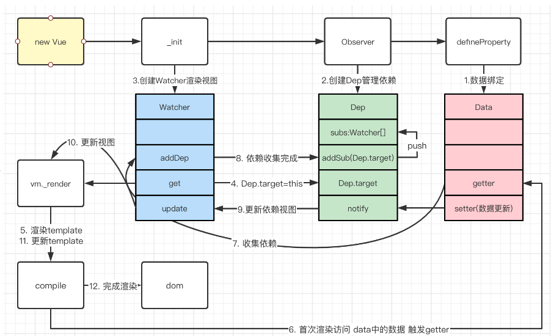

# 手写响应式原理

根据之前整理的流程



## 使用

```html
...
<div id="app">
</div>
<input type="text" name="" id="value">
<br>
<button id="push">push</button>
<button id="pop">pop</button>
<script type="module" src="/main.js"></script>
...
```

```js
import MyVue from './source/MyVue'

const vm = window.vm = new MyVue({
  el: '#app',
  template: `
    <p>name: {{name}}</p>
    <p>name: {{computedName}}</p>
    <p>name: {{watchName}}</p>
    <p>inner.name: {{inner.name}}</p>
    <p>dataList[0].name: {{dataList[0].name}}</p>
    <p>list: {{list.join(',')}}</p>
  `,
  data(){
    return {
      name: 'xy',
      inner: {
        name: 'inner-xy'
      },
      list: [0, 1],
      dataList: [{ name: 'deep-xy'}],
      watchName: '2',
    }
  },
  computed: {
    computedName(){
      return `computed ${this.name} ${this.name}`
    }
  },
  watch:{
    name(val){
      this.watchName = `watch ${val}`
      console.log(this);
    }
  }
});
document.getElementById('value').addEventListener('input', (e) => {
  const value = e.target.value
  vm.name = vm.inner.name = vm.dataList[0].name = value
})
document.getElementById('push').addEventListener('click', () => {
  vm.list.push(vm.list.length)
})
document.getElementById('pop').addEventListener('click', () => {
  vm.list.pop()
})
```

## Vue 类入口

书写方法并且暴露出去，这里预计实现`state`、`computed`、`watch` 功能

```js
export default function MyVue(options){
  // vm 指向自己
  const vm = this.vm  = this
  // 使用$options存下入参
  vm.$options = options
  // 初始化 data
  initState(vm)
  // 初始化计算属性
  initComputed(vm)
  // 初始化观察属性
  initWatch(vm)
  // 挂载
  if(vm.$options.el){
    vm.$mount()
  }
}
```

接下来实现 `initState`

```js
// 初始化数据
function initState(vm){
  // 这里取出 fn
  const fn = vm.$options.data
  const data = vm._data = getData(fn, vm)

  // 代理
  for (const key of Object.keys(data)) {
    proxy(vm, '_data', key)
  }

  // 观测数据
  observe(data)
  return vm
  // 获取 data
  function getData(data, vm){
    if(typeof data !== 'function') return {}
    // 这里是清空 Dep.target 令其为 null
    pushTarget()
    try {
      return data.call(vm, vm)
    } catch (error) {
      console.log(error)
    } finally {
      // 弹出 null 值
      popTarget()
    }
  }
  // 代理 
  // vm._data.name => vm.name 
  // vm.name = vm._data.name = val
  function proxy(target, sourceKey, key){
    Object.defineProperty(target, key, {
      get(){
        return this[sourceKey][key]
      },
      set(val){
        this[sourceKey][key] = val
      },
      enumerable: true,
      configurable: true
    })
  }
}
```

这段代码最核心的部分是 `observe(data)` 

```js
// source/Observe.js
import { Dep } from './Dep';
import { arrayMethods, dependArray } from './Array';

// 观测数据
export function observe(value){
  // 如果非对象类型 或者已经完成观测过的对象忽略
  if(!value || typeof value !== 'object' || value.__ob__) return
  // new 一个 Observer 实例返回
  let ob = new Observer(value);
  return ob
}

export class Observer{
  constructor(value){
    // value => 指向 vm 实例
    this.value = value
    // new 一个 dep 实例
    this.dep = new Dep()
    // 给 vm 实例生成 __ob__属性指向当前ob实例，且不能被遍历
    Object.defineProperty(value, '__ob__', {
      value: this,
      enumerable: false,
      writable: true,
      configurable: true
    })
    // 如果是数组，走数组的观测方法
    if(Array.isArray(value)){
      // 将数组原型对象上的方法劫持后替换数组实例上的__proto__属性
      value.__proto__ = arrayMethods
      // 开始数组的依赖收集
      this.observeArray(value)
    }else{
      // 开始对对象每一项进行get/set劫持
      this.walk(value)
    }
  }
  walk(obj){
    for (const [key, val] of Object.entries(obj)) {
      // 设置为响应式数据
      defineReactive(obj, key, val)
    }
  }
  observeArray (items) {
    for (let i = 0, l = items.length; i < l; i++) {
      observe(items[i])
    }
  }
}

export function defineReactive(obj, key, val){
  // 每一个属性都生成一个 dep 实例
  const dep = new Dep()
  // 递归解决多层监听的问题
  let childOb = observe(val)

  Object.defineProperty(obj, key, {
    enumerable: true,
    configurable: true,
    get(){
      if(Dep.target){
        // 如果存在值，让当前的watcher订阅这个 dep 实例
        dep.depend()
        if(childOb){
          // 如果 childOb 是一个 ob 实例需要接着往下监听
          childOb.dep.depend();
          if(Array.isArray(val)){
            // 如果当前值为数组，则需要遍历递归增加依赖
            dependArray(val);
          }
        }
      }
      return val
    },
    set(newVal){
      if(val === newVal) return
      val = newVal
      // 如果变成对象接着监听
      childOb = observe(newVal)
      // 值变动，发出通知
      dep.notify()
    }
  })
}
```

这里面需要注意的是对数组的通知变化方式，是通过劫持原原型上方法实现的

```js
// source/Array.js
// 取出原型方法
export const arrayMethods = Object.create(Array.prototype)
// 劫持变动方法
export const methods = ['push', 'shift', 'pop', 'unshift', 'reverse', 'sort', 'splice']
// 遍历实现劫持
methods.forEach(method => {
  arrayMethods[method] = function (...args) {
    // 原方法执行
    const res = Array.prototype[method].apply(this, args)
    // 取出当前的 ob 实例
    const ob = this.__ob__
    // 通过方法/ 参数判断是否变动
    let inserted
    switch (method) {
      case 'push':
      case 'unshift':
        inserted = args
        break
      case 'splice':
        inserted = args.slice(2)
    }
    if(inserted) {
      // 变动接着监听数组增加的项
      ob.observeArray(inserted)
    }
    // 通知变化
    ob.dep.notify()
    return res
  }
})

export function dependArray(value){
  for (let i = 0; i < value.length; i++) {
    const e = value[i];
    // 如果存在，直接收集依赖
    if(e && e.__ob__ && e.__ob__.dep){
      e.__ob__.dep.depend()
    }
    if(Array.isArray(e)){
      // 如果数组，接着递归
      dependArray(e)
    }
  }
}
```

`Dep`类实现了收集依赖和派发通知

```js
// source/Dep.js
// 唯一id
let id = 0
export class Dep {
  constructor(){
    this.id = id++
    // 订阅数组
    this.subs = []
  }
  addSub(watcher){
    // 添加一个Watcher实例到订阅数组中
    this.subs.push(watcher)
  }
  removeSub(watcher){
    // 从订阅数组中删除某个Watcher实例
    this.subs = this.subs.filter(w => w !== watcher)
  }
  depend(){
    // 依赖收集
    if(Dep.target){
      // 在当前的Watcher实例中添加当前dep实例
      Dep.target.addDep(this)
    }
  }
  notify(){
    // 通知watcher更新
    this.subs.forEach(sub => sub.update())
  }
}
// 用于标识全局唯一的Watcher实例
Dep.target = null
// Dep.target栈 初始化父组件 -> 初始化子组件 -> 子组件完成观测，弹出 -> 父组件完成观测
const stack = []
// push Watcher 实例
export function pushTarget(target){
  stack.push(target)
  Dep.target = target
}
// pop Watcher实例
export function popTarget(){
  stack.pop()
  Dep.target = stack[stack.length - 1]
}
```

接着来实现`Watcher`

```js
import { pushTarget, popTarget } from './Dep';
import { util } from './Compiler';
// 唯一id
let id = 0
export class Watcher{
  constructor(vm, expOrFn, cb, opts = {}) {
    // watcher.vm 指向 vm 实例
    this.vm = vm
    this.id = ++id
    // 是否惰性 computed
    this.lazy = !!opts.lazy
    this.dirty = this.lazy
    // 数据变化后触发钩子 watch
    this.cb = cb || (() => {})
    // 取值函数
    this.getter = typeof expOrFn === 'function' ? expOrFn : () => {
      return util.getValue(vm, expOrFn)
    }
    this.depIds = new Set()
    this.newDepIds = new Set() // 避免求值过程中的重复依赖
    this.deps = []
    this.newDeps = []
    // 求值
    this.value = this.lazy ? undefined : this.get()
  }
  get(){
    // 触发依赖收集
    pushTarget(this)
    // 将自身作为全局Dep.target的watcher实例
    let value
    const vm = this.vm
    try {
      // 执行求值函数进行求值
      value = this.getter.call(vm, vm)
    } catch (error) { 
      console.log(error)
    } finally {
      // 清除 deps
      this.cleanupDeps()
      // 弹出
      popTarget()
    }
    return value
  }
  run(){
    // 执行求值
    let value = this.get()
    if(this.value !== value){
      // 如果值发生变动，触发 watch
      this.cb.call(this.vm, value, this.value)
      this.value = value
    }
  }
  addDep(dep){
    let id = dep.id
    if (!this.newDepIds.has(id)) {
      this.newDepIds.add(id)
      this.newDeps.push(dep)
      // 两次去重避免 this.name + this.name 这种情况
      if (!this.depIds.has(id)) {
        // 订阅变化
        dep.addSub(this)
      }
    }
  }
  update(){
    // 更新方法
    if(this.lazy){
      // computed 只有在 dirty 为真的时候去求值
      this.dirty = true
    }else{
      // 进入队列等待一起执行
      queueWatcher(this)
    }
  }
  evalValue(){
    // computed 的求值方法
    this.value = this.get()
    this.dirty = false
  }
  depend(){
    // computed 收集依赖触发
    let i = this.deps.length
    while(i--){
      this.deps[i].depend()
    }
  }
  
  /**
   * 清理依赖收集
   */
  cleanupDeps () {
    let i = this.deps.length
    while (i--) {
      const dep = this.deps[i]
      if (!this.newDepIds.has(dep.id)) {
        dep.removeSub(this)
      }
    }
    let tmp = this.depIds
    this.depIds = this.newDepIds
    this.newDepIds = tmp
    this.newDepIds.clear()
    tmp = this.deps
    this.deps = this.newDeps
    this.newDeps = tmp
    this.newDeps.length = 0
  }
}

let has = {} // 去重
let queue = [] // 执行队列
function queueWatcher(watcher){
  let id = watcher.id
  if(!has[id]){
    has[id] = true
    // 收集watcher实例
    queue.push(watcher)
  }
  // 下一个微任务循环统一执行
  nextTick(flushQueue)
}
function flushQueue(){
  // 这里watch可能存在异步加入的情况
  for (let i = 0; i < queue.length; i++) {
    let watcher = queue[i]
    let id = watcher.id
    has[id] = null
    // 依次触发
    watcher.run()
  }
  // 重置
  queue = []
  has = {}
}

// 回调队列
let callbacks = []
function flushCallbacks(){
  callbacks.forEach(cb => cb())
  callbacks = []
}
function nextTick(flushQueue){
  callbacks.push(flushQueue)
  // Promise.resolve().then 创建一个微任务
  return Promise.resolve().then(flushCallbacks)
}
```

`watcher` 实例实在`$mounted`之前完成的

```js
// mount
MyVue.prototype.$mount = function(){
  const vm = this
  vm.$el = query(vm.$options.el)
  // 创建实例
  new Watcher(vm, () => {
    console.log('渲染')
    vm._update()
  })
  return vm
  // 获取el进行挂载
  function query(el) {
    if (typeof el === 'string'){
        return document.querySelector(el)
    }
    return el
  }
}
MyVue.prototype._update = function(){
  const vm = this
  const el = vm.$el
  // 实际上这里会去patch vNode 这里直接简单点替换模板了
  el.innerHTML = compiler(vm)
}
// source/Compiler.js
// 这里简单的做模板数据替换
const Reg = /\{\{((?:.|\r?\n)+?)\}\}/g

export const util = {
  getValue(vm, exp){
    let val
    eval(`val = vm.${exp}`)
    return val
  },
  compilerText(vm){
    return vm.$options.template.replace(Reg, (...args) => {
      return util.getValue(vm, args[1])
    })
  }
}
export function compiler(vm){
  return util.compilerText(vm)
```

至此，响应式的原理已经写完了，接下去写`computed`的逻辑

```js

// 计算属性相关
function initComputed(vm){
  // 获取计算属性
  const computed = vm.$options.computed || Object.create(null)
  // 初始化watcher实例的容器
  let watcher = vm._watcherComputed = Object.create(null)
  for (const [key, userDef] of Object.entries(computed)) {
    // 创建 watcher 实例
    watcher[key] = new Watcher(vm, userDef, () => {}, { lazy: true })
    // 在 vm 实例创建对应属性和取值函数，进行依赖收集和数据更新
    Object.defineProperty(vm, key, {
      // 这里用了个闭包保存了引用
      get:((vm, key) => {
        let watcher = vm._watcherComputed[key]
        return function(){
          if(watcher){
            if(watcher.dirty){
              // 如果有需要更新再进行更新操作
              watcher.evalValue()
            }
            if(Dep.target){
              // 依赖收集
              watcher.depend()
            }
            // 返回值
            return watcher.value
          }
        }
      })(vm, key)
    })
  }
}

```

最后把`watch`补完

```js
// 观察方法
MyVue.prototype.$watch = function(key, handler){
  let vm = this
  // 直接创建一个 watcher 实例
  const watcher = new Watcher(vm, key, handler)
  // immediate
  handler.call(vm, watcher.value);
  return
}

function initWatch(vm){
  const watch = vm.$options.watch || Object.create(null)
  // 监听每一项
  for (const [key, handler] of Object.entries(watch)){
    vm.$watch(key, handler)
  }
}
```

